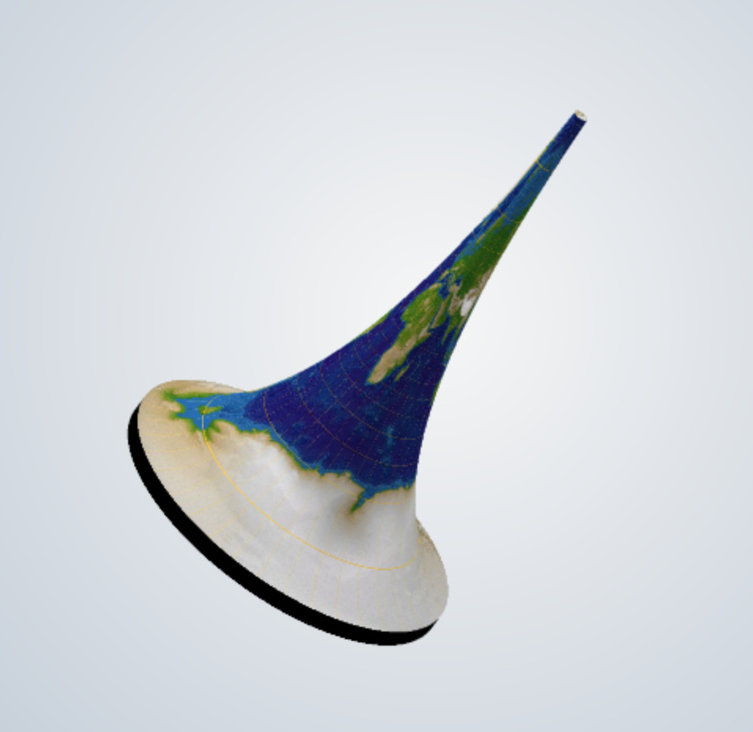
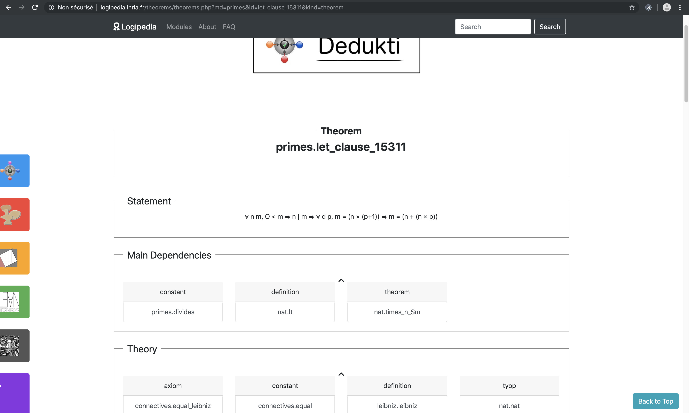

# Abstract to concrete through illustrations

I see:

- mathematical objects as abstract
- illustrations as concrete

What I mean by illustrations: images, tangible objects, interactive pieces of software...

. . .

**My personal, concflicted view on it:**

- On one side, a concrete illustration representing an abstract object modifies the perception of this abstract object and the internalized knowledge we have of it.

- On the other side, many abstract mathematical concepts that do not possess "nice" illustrations (yet) remain esoteric and their knowledge and perception is reserved to a narrow set of specialists. 

\note{
In my next postdoc, I will be producing a lot of mathematical objects. My personal motivation is to make them pass from abstract to concrete and see the effect this concrete illustrations have on people. 
}

# First example : Kummer surfaces

\

\note{
Surfer image.
Lancer vidéo.
}

# ...a formal definition

The Kummer variety of the Jacobian variety of a smooth hyperelliptic curve of genus 2 is a quotient of the Jacobian by the Kummer involution x ↦ −x. The Kummer involution has 16 fixed points: the 16 2-torsion point of the Jacobian, and they are the 16 singular points of the quartic surface.

\note{
wikipedia
}

# Second example : using non-flat mathematical surfaces for visualising other data

\

\note{
Image de sculpteo, je n'ai pas trouvé la photo.
Projet initié après une suggestion des responsables math du Palais de la découverte.
Idée: rendre un objet peu familier (la surface), plus familier on y projettant un 
}

# Third example : Proof visualisation

Logipedia: databasis of mathematical proofs

\

# Brainstorming questions for the public

- Would you like to own/have access to an illustration of a mathematical object/proof, why ?

. . .

- For quite a long time, and still today, quite many professional mathematicians try to avoid using illustrations in their research. Can you imagine why ? How to make them like concrete objects/illustrations again?

. . .

- How would you measure the impact of the illustration, the cost?

. . .

- Do you like better to see an image of a mathematical object made by a non-mathematician or made by a mathematician ?

# Bonus: Dali's vision of a hypercube

\

::: notes

Don't forget the brainstorming
:::
